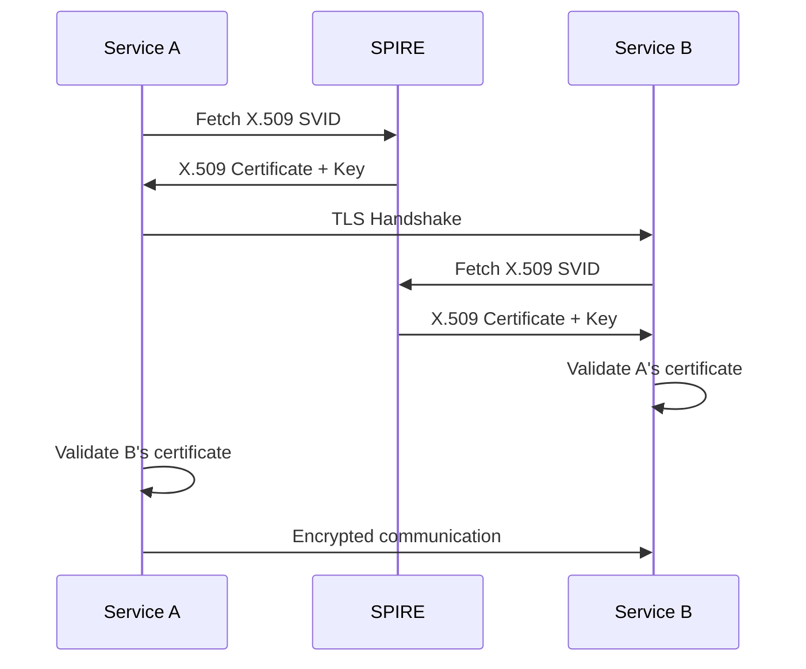
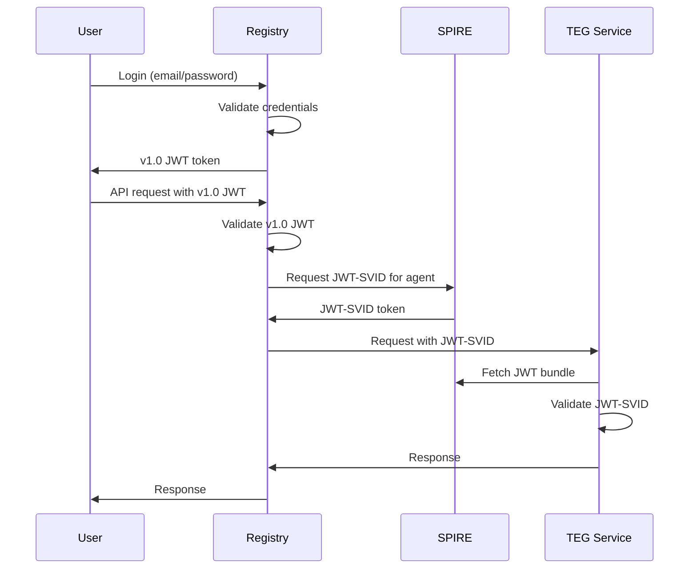

# AgentVault Identity Fabric - Security Foundation

## Overview

The Identity Fabric is the security foundation of AgentVault, providing cryptographic workload identity and policy-based authorization for all components. Built on SPIFFE/SPIRE and OPA standards, it implements Zero Trust principles throughout the system.

## Architecture

### Core Components

1. **SPIFFE/SPIRE Stack**
   - SPIRE Server: Control plane for identity management
   - SPIRE Agent: Data plane for workload attestation
   - Workload API: Identity delivery to applications

2. **OPA Policy Engine**
   - Policy decision point for authorization
   - Rego policy language for flexible rules
   - Integration with SPIFFE identities

3. **Authentication Bridges**
   - JWT-SVID bridge for v1.0.0 compatibility
   - mTLS for service-to-service communication
   - Token exchange mechanisms

## Identity Model

### Trust Domain
```
Trust Domain: agentvault.com
```

### Identity Hierarchy
```
Root of Trust: SPIRE Server CA
│
├── Node Identities (SPIRE Agents)
│   └── spiffe://agentvault.com/spire-agent
│
├── Service Identities
│   ├── spiffe://agentvault.com/service/registry-backend
│   ├── spiffe://agentvault.com/service/teg-core
│   ├── spiffe://agentvault.com/service/chronicle
│   └── spiffe://agentvault.com/service/opa
│
└── Agent Identities
    ├── spiffe://agentvault.com/agent/{agent_id}
    └── spiffe://agentvault.com/agent/executor/{type}
```

## SPIFFE/SPIRE Implementation

### SPIRE Server Configuration

```hocon
server {
    bind_address = "0.0.0.0"
    bind_port = "8081"
    socket_path = "/opt/spire/sockets/registration.sock"
    trust_domain = "agentvault.com"
    data_dir = "/opt/spire/data"
    log_level = "INFO"
    
    # JWT SVID configuration
    jwt_issuer = "spiffe://agentvault.com"
    
    # CA configuration (MVP: self-signed)
    ca_subject {
        country = ["US"]
        organization = ["AgentVault"]
        common_name = "AgentVault CA"
    }
    
    # TTL settings
    default_x509_svid_ttl = "1h"
    default_jwt_svid_ttl = "5m"
}
```

### SPIRE Agent Configuration

```hocon
agent {
    data_dir = "/opt/spire/data"
    log_level = "INFO"
    server_address = "spire-server"
    server_port = "8081"
    socket_path = "/opt/spire/sockets/agent.sock"
    trust_bundle_path = "/opt/spire/conf/bundle.crt"
    trust_domain = "agentvault.com"
    
    # Workload attestors
    authorized_delegates = [
        "spiffe://agentvault.com/spire-agent"
    ]
}
```

### Workload Registration

```bash
# Register a service workload
spire-server entry create \
    -parentID spiffe://agentvault.com/spire-agent \
    -spiffeID spiffe://agentvault.com/service/teg-core \
    -selector docker:label:com.agentvault.service:teg-core \
    -ttl 3600 \
    -jwtSVIDTTL 300

# Register an agent identity
spire-server entry create \
    -parentID spiffe://agentvault.com/service/registry-backend \
    -spiffeID spiffe://agentvault.com/agent/agent123 \
    -selector k8s:pod-name:agent-123 \
    -ttl 3600
```

## Identity Types

### X.509 SVIDs

Used for mTLS between services:
- Certificate lifetime: 1 hour
- Automatic rotation at 50% lifetime
- Contains SPIFFE ID in SAN field
- Private key never leaves workload

### JWT SVIDs

Used for API authentication:
- Token lifetime: 5 minutes
- Audience-restricted tokens
- Standard JWT claims plus SPIFFE ID
- Validated against SPIRE trust bundle

## OPA Policy Integration

### Policy Architecture

```
┌─────────────────┐     ┌─────────────────┐
│    Workload     │────▶│  Policy Query   │
│  (with SVID)    │     │                 │
└─────────────────┘     └────────┬────────┘
                                 │
                                 ▼
                        ┌─────────────────┐
                        │   OPA Server    │
                        │                 │
                        │  Rego Policies  │
                        └─────────────────┘
```

### Base Policy Structure

```rego
package agentvault.authz

import future.keywords

default allow = false

# Allow services to access their own resources
allow if {
    input.subject.type == "service"
    input.subject.id == input.resource.owner
}

# Allow agents with valid attestations
allow if {
    input.subject.type == "agent"
    valid_attestation[input.subject.id]
}

# Role-based access for admin operations
allow if {
    input.subject.role == "admin"
    input.action in admin_actions
}

admin_actions := {
    "token.issue",
    "account.suspend",
    "policy.create"
}
```

### Policy Query Format

```json
{
  "input": {
    "subject": {
      "id": "spiffe://agentvault.com/agent/agent123",
      "type": "agent",
      "role": "standard"
    },
    "action": "token.transfer",
    "resource": {
      "type": "token_balance",
      "owner": "spiffe://agentvault.com/agent/agent123"
    }
  }
}
```

## Authentication Flows

### Service-to-Service (mTLS)



### Agent Authentication (JWT-SVID)



## Security Features

### Attestation Mechanisms

1. **Node Attestation**
   - Join tokens (development)
   - AWS/GCP/Azure attestors (cloud)
   - Kubernetes PSATs (K8s)

2. **Workload Attestation**
   - Unix process (UID/GID)
   - Docker labels
   - Kubernetes selectors
   - Environment variables

### Automatic Rotation

- X.509 certificates: Rotated at 50% TTL
- JWT tokens: Short-lived, fetched on-demand
- No manual key management required
- Zero-downtime rotation

### Trust Bundle Management

```bash
# Export trust bundle
spire-server bundle show -format spiffe

# Federate with another trust domain
spire-server bundle set \
    -id spiffe://partner.com \
    -path partner-bundle.crt
```

## Integration Patterns

### Python Integration

```python
from pyspiffe.workloadapi import default_workload_api_client
from pyspiffe.spiffe_id import SpiffeId
import httpx

class SPIFFEEnabledService:
    def __init__(self):
        self.workload_api_client = default_workload_api_client()
        
    def get_mtls_client(self):
        """Create mTLS-enabled HTTP client"""
        x509_context = self.workload_api_client.fetch_x509_context()
        
        return httpx.Client(
            cert=(
                x509_context.default_svid().cert_chain,
                x509_context.default_svid().private_key
            ),
            verify=x509_context.bundle_store
        )
    
    def get_jwt_token(self, audience: str) -> str:
        """Fetch JWT-SVID for API calls"""
        jwt_svids = self.workload_api_client.fetch_jwt_svid(
            audiences=[audience]
        )
        return jwt_svids[0].token
```

### Go Integration

```go
package main

import (
    "context"
    "github.com/spiffe/go-spiffe/v2/workloadapi"
    "github.com/spiffe/go-spiffe/v2/spiffeid"
)

func main() {
    ctx := context.Background()
    
    // Create workload API client
    client, err := workloadapi.New(ctx)
    if err != nil {
        panic(err)
    }
    defer client.Close()
    
    // Fetch X.509 SVID
    x509Context, err := client.FetchX509Context(ctx)
    if err != nil {
        panic(err)
    }
    
    // Create mTLS server
    server := &http.Server{
        TLSConfig: tlsconfig.MTLSServerConfig(
            x509Context.DefaultSVID(),
            x509Context.Bundles,
            tlsconfig.AuthorizeAny(),
        ),
    }
}
```

## Deployment

### Quick Start with Docker Compose

**Important**: SPIRE requires a special initialization process for the agent to obtain a join token. See [SPIRE Quick Start Guide](./SPIRE_QUICK_START.md) for the simple 3-step process.

For detailed information about the join token solution, see [SPIRE Agent Token Solution](./SPIRE_AGENT_TOKEN_SOLUTION.md).

### Docker Compose Configuration

```yaml
services:
  spire-server:
    image: ghcr.io/spiffe/spire-server:1.9.1
    volumes:
      - ./spire-server:/opt/spire/conf
      - spire-data:/opt/spire/data
    command: ["-config", "/opt/spire/conf/server.conf"]
    
  spire-agent:
    image: ghcr.io/spiffe/spire-agent:1.9.1
    volumes:
      - ./spire-agent:/opt/spire/conf
      - /var/run/docker.sock:/var/run/docker.sock:ro
      - spire-sockets:/opt/spire/sockets
    command: ["-config", "/opt/spire/conf/agent.conf"]
    
  opa:
    image: openpolicyagent/opa:0.61.0
    volumes:
      - ./policies:/policies
    command: ["run", "--server", "/policies"]
```

### Kubernetes

```yaml
apiVersion: v1
kind: ConfigMap
metadata:
  name: spire-server
data:
  server.conf: |
    server {
      trust_domain = "agentvault.com"
      # ... configuration
    }
---
apiVersion: apps/v1
kind: StatefulSet
metadata:
  name: spire-server
spec:
  # ... deployment spec
```

## Monitoring & Operations

### Health Checks

```bash
# SPIRE Server health
curl http://localhost:8080/live
curl http://localhost:8080/ready

# SPIRE Agent health
curl http://localhost:8082/live
curl http://localhost:8082/ready

# OPA health
curl http://localhost:8181/health
```

### Metrics

SPIRE exposes Prometheus metrics:
- SVID issuance rate
- Attestation success/failure
- API latencies
- Trust bundle updates

### Debugging

```bash
# View all registrations
spire-server entry show

# Test workload attestation
spire-agent api fetch x509 \
    -socketPath /opt/spire/sockets/agent.sock

# Debug JWT validation
spire-agent api validate jwt \
    -audience "spiffe://agentvault.com/service/teg-core" \
    -svid "eyJ..."
```

## Security Considerations

### Defense in Depth

1. **Network Layer**: TLS 1.3 minimum
2. **Identity Layer**: SPIFFE IDs for all workloads
3. **Authentication**: mTLS + JWT-SVIDs
4. **Authorization**: OPA policies
5. **Audit**: Comprehensive logging

### Key Management

- No long-lived secrets in code
- Private keys generated in-memory
- Automatic rotation before expiry
- Hardware security module (HSM) support

### Threat Model

Protected against:
- Man-in-the-middle attacks (mTLS)
- Identity spoofing (cryptographic proof)
- Token replay (short TTLs)
- Privilege escalation (OPA policies)
- Key compromise (automatic rotation)

## Future Roadmap

### Phase 1: Production Hardening
- [ ] Replace self-signed CA with proper PKI
- [ ] Implement HSM integration
- [ ] Add SPIRE Server HA configuration
- [ ] Enhance monitoring and alerting

### Phase 2: Advanced Features
- [ ] SPIFFE Federation for partner integration
- [ ] Custom attestation plugins
- [ ] Dynamic policy updates via OPA bundles
- [ ] Workload identity for all agent types

### Phase 3: Enterprise Features
- [ ] Integration with enterprise IdPs
- [ ] Compliance reporting (SOC2, ISO27001)
- [ ] Disaster recovery procedures
- [ ] Multi-region federation

## Best Practices

1. **Registration Management**
   - Use selectors that can't be spoofed
   - Implement least-privilege SPIFFE IDs
   - Regular audit of registrations

2. **Policy Design**
   - Start with deny-by-default
   - Use structured policy organization
   - Test policies before deployment
   - Version control all policies

3. **Operational Excellence**
   - Monitor SVID expiration
   - Alert on attestation failures
   - Regular security audits
   - Disaster recovery testing

## Conclusion

The Identity Fabric provides a robust, standards-based security foundation for AgentVault. By implementing SPIFFE/SPIRE with OPA, the system achieves:

- **Zero Trust Architecture**: No implicit trust between components
- **Cryptographic Identity**: Strong, verifiable identities for all workloads  
- **Automatic Management**: No manual certificate handling
- **Policy-Based Authorization**: Flexible, auditable access control
- **Future-Proof Design**: Based on open standards with clear evolution path